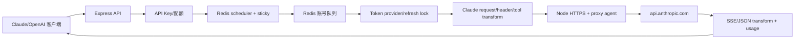
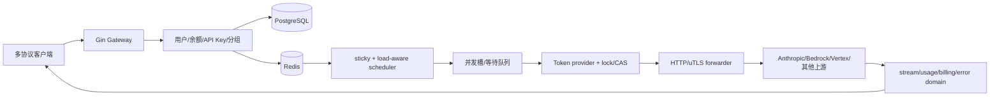
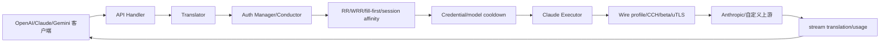
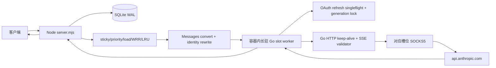
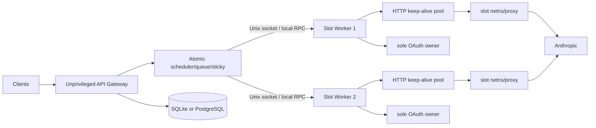

# Claude HTTP 转发架构对比与 KIN 稳定性优化建议

> 对比项目：Claude Relay Service、Sub2API、CLIProxyAPI、KIN Gateway  
> 分析日期：2026-08-19  
> 结论基于指定源码快照，不代表后续版本。

> **实施更新**：本文静态分析后，KIN 已在本分支完成第一轮目标改造：容器内长驻 Go slot worker、强制槽位 SOCKS5、worker 单一 OAuth refresh owner、priority/load/平滑 WRR/LRU 调度、account/model cooldown、有界 failover、两阶段 sticky、attempt 审计，以及 realtime/verified 两种终态策略。文中“原实现/改造前”风险用于说明改造动机。

## 1. 结论摘要

四个项目当前都属于 **Claude 直接 HTTP 转发**架构：网关读取 OAuth/API Key，构造 Anthropic Messages 请求，并自行处理协议转换、身份字段、流式响应、调度和凭证生命周期。

它们不是同一种规模或定位：

| 项目 | 核心定位 | Claude 数据面 | 最突出能力 |
|---|---|---|---|
| [Claude Relay Service](https://github.com/Wei-Shaw/claude-relay-service)（CRS） | Claude 多账号中继 | Node.js 进程直接 HTTPS | Redis 调度、账号队列、较完整的 Claude 运营功能 |
| [Sub2API](https://github.com/Wei-Shaw/sub2api) | 订阅额度分发 SaaS/API 网关 | Go HTTP/uTLS，多上游 | 分布式调度、计费、故障转移、完整控制面 |
| [CLIProxyAPI](https://github.com/router-for-me/CLIProxyAPI) | 本地/服务端多供应商 CLI 代理 | Go uTLS executor | 协议翻译、Claude wire profile、多凭证 selector |
| **KIN Gateway** | 多槽位 Claude HTTP 网关 | 宿主机按槽位 UID 启动 Node HTTPS worker | UID 出口、Docker 槽位、SQLite、本地备份 |

### 1.1 最重要的架构判断

1. **KIN 已不再以 `claude -p` 作为默认推理路径。**  
   默认路径是 `server.mjs → crs-relay.mjs → UID worker → api.anthropic.com`。

2. **KIN 的 HTTP worker 实际运行在宿主机，不在 Docker 槽位容器内。**  
   容器主要承载槽位 home、运行元数据和可选沙箱；网关父进程读取槽位 token，再通过 stdin 交给设置了 UID/GID 的 Node 子进程。

3. **KIN 的“虚拟机”是 Docker 槽位，不是 KVM/microVM。**  
   不同镜像提供不同 userland，但共享宿主机内核；默认 `host` network 也不是独立网络隔离。

4. **切换到 HTTP 后，KIN 恢复了原生 Messages 语义。**  
   多轮消息、工具、并行工具、历史图片、采样参数、stop、`tool_choice`、thinking、cache control 和 context management 不再受旧 CLI prompt flatten 限制。

5. **切换到 HTTP 后，OAuth 刷新所有权成为 KIN 的最高优先级缺口。**  
   最新源码的 relay 只读 access token，临期后仍记录为 `defer_to_cli`。如果生产已不再使用 CLI 刷新，就必须明确新的唯一 refresh owner。

6. **KIN 改造重点是把协议能力变成稳定的数据面。**
   本分支已用长驻 Go worker、连接池、refresh singleflight、账号池和 stream 终态审核替换改造前的每请求 Node worker。

### 1.2 场景化选择

- 需要完整用户、分组、余额、支付、计费、多实例：优先参考 **Sub2API**。
- 需要本地部署、多供应商、多协议、高速跟进客户端 wire：优先参考 **CLIProxyAPI**。
- 需要相对简单的 Node Claude 账号池：CRS 可作历史参考，但其 README 已推荐迁移到 Sub2API。
- 需要保留 KIN 的槽位出口和轻量 SQLite：继续演进 KIN，但应改成长驻 per-slot HTTP worker，而不是回到 Claude CLI。

---

## 2. 分析基线与限制

### 2.1 源码快照

| 项目 | Commit / Tag | 日期 |
|---|---|---|
| KIN | `9374ffd802433ed0232a12f63189d5d79fb634f2` | 2026-08-19 |
| CRS | `8479c7ce358b6bfd6a06287812c786f9533d27a4` / `v1.1.314` | 2026-07-23 |
| Sub2API | `7d9c958482eaf4f81a820702a98b40db6cbddf54` | 2026-08-19 |
| CLIProxyAPI | `55397bf68d01a99dc8fd523fe56719857afd579c` | 2026-08-19 |

源码规模仅作为维护面参考：

| 项目 | 跟踪文件 | 测试文件 |
|---|---:|---:|
| KIN | 120 | 45 |
| CRS | 367 | 38 |
| Sub2API | 3564 | 1157 |
| CLIProxyAPI | 1347 | 524 |

测试文件数不等于测试用例数，也不直接等于代码质量。

本分支实际运行 `npm test`：共 260 项，258 项通过、0 项失败、2 项 live network 测试跳过；Go worker 另通过 `go test -race ./...` 与 `go vet ./...`。

### 2.2 分析限制

- 本文是源码静态分析，没有用同一批真实 Claude 账号做四项目线上压测。
- 不提供可用率、QPS、TTFT 等未经统一测试的绝对数值。
- KIN 引用的 `/opt/kin-gateway/hypervisor/socks-egress.sh` 不在仓库中，本文无法审计其实现。
- 用户确认生产不再使用 Claude CLI 推理；最新源码仍保留 CLI fallback、VM workspace CLI 和 CLI 模型目录，本文将其视为残留兼容路径。
- 使用订阅账号中继、账号共享或客户端身份重构可能涉及供应商条款风险；技术架构评价不代表法律或服务条款结论。

---

## 3. 术语

### 3.1 直接 HTTP relay

网关自己执行以下工作：

- 读取 access token/API Key；
- 构造 `/v1/messages` 请求；
- 设置 `Authorization`、`anthropic-version`、beta、UA 等；
- 建立 TLS/代理连接；
- 解析 JSON/SSE；
- 自己负责 token 刷新和失败处理。

四个项目的默认 Claude 推理都属于这一类。

### 3.2 Claude Code wire profile

指 Claude Code 在网络层表现出的组合特征，例如：

- `claude-cli/*` User-Agent；
- `x-app`、`x-stainless-*`；
- `anthropic-beta` 的内容和顺序；
- `metadata.user_id`；
- system 中的 billing/CCH 块；
- cache control、diagnostics、context management；
- TLS ClientHello 和 header casing/order。

这些不是标准 Messages API 的全部必要条件，但直接 OAuth relay 项目通常会持续跟踪它们。

### 3.3 槽位与 VM

本文把 KIN 的一个账号执行单元称为“槽位”：

- 一个 VM JSON；
- 一个 `cli-home`；
- 一个 Docker container 记录；
- 一个 OAuth 账号；
- 可选独立 UID 和 SOCKS 出口。

它不是拥有独立内核的传统虚拟机。

---

## 4. 四套架构

## 4.1 Claude Relay Service



关键事实：

- `claudeRelayService.js` 直接访问 `https://api.anthropic.com/v1/messages?beta=true`。
- Redis 保存账号、sticky、临时不可用、队列、限额和 token refresh lock。
- 非 Claude Code 客户端会进行 system、metadata、header 和工具名处理。
- 支持 Claude OAuth、Console、Bedrock、CCR 等多种账号来源。
- 项目自身已把 Sub2API 定位为后继项目；README 还提示旧版本管理员认证绕过风险。

## 4.2 Sub2API



关键事实：

- Go + Gin + Ent + PostgreSQL + Redis。
- Claude 原生路径直接 HTTP/uTLS；支持 OAuth、Setup Token、API Key、Bedrock、Vertex 和自定义 relay。
- 调度考虑 sticky、模型路由、优先级、负载率、LRU、RPM、窗口费用、额度和并发。
- 同账号重试有次数、指数退避和总时间预算；handler 还能在响应未提交时切换账号。
- token provider 具备 DB 重读、进程锁、分布式锁、版本检查、后台刷新和竞争恢复。
- 控制面包含用户、支付、余额、分组、代理、监控、备份恢复等完整 SaaS 功能。

## 4.3 CLIProxyAPI



关键事实：

- 名称中的 CLI 表示“为 CLI 模型提供兼容 API”，Claude 数据面并不启动 Claude 可执行文件。
- Claude executor 使用 uTLS 直接请求 `/v1/messages?beta=true`。
- 支持普通 round robin、平滑 WRR、fill-first 和多信号 session affinity。
- Auth conductor 处理多凭证轮换、模型级/凭证级 cooldown、请求级错误规则和 401 刷新重试。
- Claude wire profile 维护非常细，包括 beta 顺序、CCH、diagnostics、MCP alias、cache TTL 和设备身份。
- 默认偏本地文件控制面，也支持 Git、对象存储、PostgreSQL和可选 Home；这些可选能力不等于默认多实例 HA。

## 4.4 KIN Gateway



### 改造后的边界

- 每槽唯一 UID、一个容器和一个长驻 Go worker。
- worker 通过 Unix socket接收业务 request，gateway 不向 RPC传 token。
- worker 是 `credentials.json` 和 refresh rotation 的唯一 owner。
- inference、refresh、usage、models使用同一显式 SOCKS5；无代理时 fail closed。
- 默认 realtime stream；可选 verified缓冲到 `message_stop` 后回放。
- 每次账号尝试持久化到 `request_attempts`，sticky只在终态成功后提交。

Docker 槽位仍不是 KVM/microVM，但 worker、凭证和网络数据面已进入槽位容器边界。

---

## 5. Claude 请求链路差异

| 阶段 | CRS | Sub2API | CLIProxyAPI | KIN |
|---|---|---|---|---|
| 入站 | Anthropic + OpenAI 兼容 | 多协议、多业务入口 | OpenAI/Responses/Claude/Gemini | Messages/Chat/Completions/Responses |
| 标准化 | Claude/OpenAI 转换 | 多套 provider adapter | translator registry | 转成 Messages |
| 客户端识别 | UA + system 特征 | UA + metadata + billing 特征 | 多信号检测 | UA/headers 简单分类 |
| system | 非官方请求重构/迁移 | 可透传或详细 mimicry | 可 cloaking/重构 | 保留原 system，追加一行 Claude Code |
| metadata | 生成/替换 device/session | 按指纹与配置改写 | 稳定 credential identity | VM device + OAuth account + session hash |
| header | 捕获并统一 UA/beta | 白名单、指纹、beta policy | 版本化细粒度 profile | 存储官方 header或硬编码默认 |
| TLS | Node TLS/proxy agent | Go HTTP/uTLS profile | uTLS | Go transport + 显式 SOCKS5 |
| 上游 | 进程内连接池 | 进程内 transport | 进程内 transport cache | 每槽长驻 keep-alive client |
| stream | 直接/转换 | 严格事件和 usage 处理 | bootstrap/转换/取消 | SSE状态机 + realtime/verified |
| usage | Redis 统计 | 完整 billing/usage | usage reporter | SQLite account quota/log |
| 失败恢复 | 账号状态 + 有限重试 | typed retry/failover | credential rotation/cooldown | typed scope + cooldown + 有界跨槽 failover |

---

## 6. 功能矩阵

图例：

- **完整**：主路径原生或有成熟转换实现。
- **部分**：支持但有范围、入口或持久化限制。
- **残留**：源码存在，但不是 KIN 当前目标运行方式。
- **无**：当前对比范围内没有对应能力。

| 功能 | CRS | Sub2API | CLIProxyAPI | KIN |
|---|---|---|---|---|
| Anthropic Messages | 完整 | 完整 | 完整 | 完整 |
| Messages count_tokens | 完整 | 完整 | 完整 | 无公开端点 |
| OpenAI Chat → Claude | 完整 | 完整 | 完整 | 完整 |
| OpenAI Completions | 部分 | 部分 | 部分 | 完整（legacy） |
| OpenAI Responses → Claude | 项目支持 Responses，但 Claude 专用路径有限 | 完整 | 完整 | 完整 |
| Gemini 协议/模型 | 完整 | 完整 | 完整 | 无 |
| streaming/non-stream | 完整 | 完整 | 完整 | 完整 |
| Anthropic tools | 完整 | 完整 | 完整 | 完整 |
| 并行 tool_use | 完整 | 完整 | 完整 | Messages 原生完整；跨协议依赖 converter |
| 图片输入 | 完整 | 完整 | 完整 | 完整 |
| thinking/signature | 部分 | 完整并带修复策略 | 完整并带 replay/cache | 透传为主 |
| cache_control | 有清理和上限 | 丰富策略 | 丰富 TTL/profile 策略 | 透传和上限清洗 |
| context_management | 依版本 | 完整 beta policy | 完整 profile | 透传 |
| Claude Code header profile | 捕获/默认 | 指纹服务 + policy | 最细粒度 | 捕获/硬编码默认 |
| uTLS/TLS 指纹 | 无 | 有 | 有 | 无 |
| OAuth | 完整 | 完整 | 完整 | access 读取完整；自动续期闭环缺失 |
| API Key 上游 | 多类型 | 完整 | 完整 | 主要是 OAuth |
| Bedrock/Vertex | Bedrock 等 | 完整 | 多 provider | 无 |
| 多账号 | 完整 | 完整 | 完整 | 多槽位 |
| 分组/路由 | 完整 | 完整 | provider/model route | 基础 |
| sticky/session affinity | Redis sticky | 分布式 sticky | 多信号 affinity | SQLite sticky |
| 权重调度 | 优先级/LRU为主 | priority/load/LRU | RR/WRR/fill-first | 配置有 weight，热路径未消费 |
| 原子并发槽 | 部分 | 完整/分布式 | manager 状态 | 单进程内存计数 |
| 有界等待队列 | Redis 账号队列 | 完整 | cooldown wait | 无 |
| 同账号重试 | 有限 | 有预算 | 可配置 | 无系统化 HTTP retry |
| 跨账号 failover | 部分 | 完整 | 多 credential | 无 |
| 模型/账号 cooldown | 有 | 完整 | 完整 | 额度预拦截为主 |
| per-account proxy | agent | 完整 | 完整 | UID owner-match/外层 SOCKS |
| 计费/余额 | 统计/成本 | 完整 SaaS | 默认不内置持久化计费 | 请求/token 统计，无支付 |
| Web 管理 | 完整 | 完整 | 管理 API/外部面板 | 独立 kin-console |
| 备份恢复 | 数据迁移工具 | PostgreSQL + S3 | 取决于 store | SQLite 本地备份 |
| 默认多实例 | Redis 可共享部分状态 | 最完整 | 否，需 Home/store | 否 |

---

## 7. 各项目优劣

## 7.1 CRS

### 优点

- 与 KIN 技术栈最接近，Node 代码易借鉴。
- Redis sticky、临时不可用、队列和 token refresh lock 已形成闭环。
- 对 401、403、429、529、5xx 和组织禁用有区分。
- 支持多种账号类型、代理、统计和控制台。
- 进程内 HTTP agent 可复用连接，比 KIN 每请求 worker 更高效。

### 缺点

- `claudeRelayService.js` 等核心文件体积大，历史逻辑耦合明显。
- 部分重试策略偏经验化，例如固定等待后重试 403。
- 需要持续维护 Claude Code header、beta、system 和工具名规则。
- Redis 是强依赖，部署复杂度高于 KIN SQLite。
- 项目 README 已将 Sub2API 作为后继方案。

## 7.2 Sub2API

### 优点

- 调度能力最完整：模型路由、sticky、优先级、负载率、LRU、随机去热点、RPM、费用窗口和并发槽。
- retry 有最大次数、指数退避、单次上限和总耗时预算。
- failover 明确检查响应是否已提交，防止拼接两条流。
- OAuth refresh 具备 DB 重读、local/distributed lock、token version、竞争恢复和后台 worker。
- stream 会验证 terminal event，处理 keepalive、idle timeout、部分 usage 和客户端断连。
- PostgreSQL/Redis/S3 backup 更适合多实例生产环境。

### 缺点

- 代码和部署复杂度最高。
- 用户、支付、计费等能力对小型 KIN 部署可能过重。
- Claude OAuth mimicry 和多 provider transform 面很大，回归风险也大。
- 仍需快速跟踪非公开 wire 行为。

## 7.3 CLIProxyAPI

### 优点

- 协议转换和多供应商覆盖最广。
- Claude profile 更新非常细，测试覆盖大量 header/beta/CCH/cache/diagnostics 场景。
- selector 支持 RR、平滑 WRR、fill-first 和 session affinity。
- 能区分 request-scoped、credential-scoped、model-scoped 失败，减少坏请求污染整个账号池。
- refresh 使用 singleflight、backoff 和后台 worker；401 可单次刷新后重试。
- 取消传播、压缩解码和首块 bootstrap 处理成熟。

### 缺点

- 追踪精确 wire 的维护成本非常高。
- 默认本地文件状态不等于分布式 HA。
- 部分 cooldown/session 状态默认只在进程内。
- terminal 校验并非所有端点统一：Responses 较严格，原生 Claude stream 正常关闭未必强制 `message_stop`。

## 7.4 KIN

### 优点

- SQLite WAL、迁移、可选 AES-GCM、凭证镜像和本地备份适合单机。
- HTTP 路径保持 Messages 业务语义，明显优于旧 CLI flatten。
- system 策略相对克制：保留调用方内容，仅追加短身份行。
- UID 出口为 per-slot 网络策略提供了基础。
- 长驻 Go worker复用连接并把 credential/refresh/SSE终态收进槽位边界。
- priority/load/平滑 WRR/LRU、两阶段 sticky 和 account/model cooldown支持账号轮询。
- managed API key HMAC存储、panel session hash和必填管理员密码收紧安全默认。
- 代码规模较小，容易针对明确目标重构。

### 剩余限制

- 单机控制面仍使用同步 SQLite，不是默认多节点 HA。
- worker inference transport已抽象但尚未达到 CLIProxyAPI 的完整 uTLS/wire profile深度。
- Docker 槽位共享宿主机内核，不是 microVM。
- realtime流在业务事件提交后不能安全换号；严格 complete-or-exhausted需使用 verified模式。

---

## 8. KIN 与 CRS 的直接对比

| 维度 | CRS | KIN 当前 |
|---|---|---|
| HTTP 执行 | 长驻 Node 服务内 | 每槽长驻 Go worker |
| 连接复用 | keep-alive/proxy agent | Go keep-alive transport |
| 账号状态 | Redis | SQLite runtime/model states + 内存 reservation |
| 账号选择 | priority/LRU/sticky/group | sticky + priority + load + WRR + LRU |
| 排队 | Redis lock/TTL/backoff | 有界取消感知 wait queue |
| access refresh | gateway refresh | Go slot worker唯一 refresh owner |
| refresh 竞争 | Redis distributed lock | singleflight + file lock + generation |
| header | 账号级捕获/统一 UA/beta | stored official header + 硬编码默认 |
| TLS | Node 默认 TLS | Go transport抽象 |
| 工具处理 | 可改写工具名并恢复 | 清洗、映射和 stream/non-stream恢复 |
| 代理 | per-account agent | container worker显式 slot SOCKS5 |
| 429/529 | 标记账号/模型并临时停用 | typed account/model/provider cooldown + failover |
| 流式 | 较完整错误处理 | SSE terminal validator + commit boundary |
| 存储备份 | Redis/迁移脚本 | SQLite + 自动本地备份 |
| 隔离 | 逻辑账号 | 唯一 UID + Docker slot + Unix socket worker |

结论：KIN 已把 CRS 类 HTTP 数据面和 Sub2API/CLIProxyAPI 的关键稳定性机制结合到槽位 worker架构；下一阶段重点是多节点状态和更完整的 TLS profile。

---

## 9. OAuth 生命周期

## 9.1 四项目对比

```mermaid
flowchart TB
    subgraph CRS
      C1[request] --> C2[expiry check]
      C2 --> C3[Redis refresh lock]
      C3 --> C4[refresh_token grant]
      C4 --> C5[encrypted account state]
    end

    subgraph Sub2API
      S1[token provider] --> S2[cache/DB reread]
      S2 --> S3[local + distributed lock]
      S3 --> S4[refresh + version/CAS]
      S4 --> S5[cache invalidate/publish]
    end

    subgraph CLIProxyAPI
      P1[auth manager] --> P2[singleflight/backoff]
      P2 --> P3[executor refresh]
      P3 --> P4[file/Home/store]
    end

    subgraph KIN
      K1[sessionKey import] --> K2[slot credentials]
      K2 --> K3[Go worker singleflight + file lock]
      K3 --> K4[slot SOCKS5 refresh + atomic generation]
    end
```



## 9.2 KIN 已实现刷新闭环

当前逻辑：

1. sessionKey CookieAuth强制使用槽位 SOCKS5。
2. 换出的 access/refresh交给 worker原子写入。
3. worker后台和请求前检查 5 分钟 refresh窗口。
4. 进程内 singleflight + credential file lock。
5. 锁内重读、二次检查、refresh、rotation和 generation更新。
6. 401最多强制刷新并重试一次。
7. inference、refresh、usage和models共用同一 explicit SOCKS5 transport。

```text
临期扫描 / 请求前检查
    → 获取 slot refresh lock
    → 从 durable store 重读最新 token/version
    → 二次判断是否仍需刷新
    → refresh_token grant
    → 原子写 access + rotated refresh + expiry + version
    → 清除旧 cache
    → 释放锁
```

已实现：

- 5 分钟 refresh skew；
- 每槽进程内 singleflight；
- credential file lock/generation；
- 刷新前重读，禁止用请求开始时的旧快照覆盖新 token；
- `invalid_grant` 后再次读取 version，识别并发刷新竞争；
- 后台刷新、指数退避和 jitter；
- 401 仅刷新一次，且只在下游响应未提交时重试；
- 永不同时允许 CLI 和 relay 刷新同一凭证。

---

## 10. 调度、重试与故障转移

## 10.1 当前成熟度

| 能力 | CRS | Sub2API | CLIProxyAPI | KIN |
|---|---:|---:|---:|---:|
| sticky | 有 | 有 | 有 | 有 |
| 原子并发 reservation | 中 | 强 | 中 | 有 |
| 负载感知 | 中 | 强 | selector 策略 | priority/load/WRR/LRU |
| 有界等待 | 有 | 强 | cooldown wait | 有 |
| model cooldown | 有 | 强 | 强 | 有 |
| request-scoped 错误 | 弱 | 强 | 强 | 无完整分类 |
| 跨账号 failover | 中 | 强 | 强 | 无 |
| stream commit 防护 | 中 | 强 | 中/强 | 弱 |

## 10.2 KIN 应采用的错误域

| 错误域 | 示例 | 行为 |
|---|---|---|
| request | 参数错误、context 过长、无 fast entitlement | 直接返回，不污染槽位 |
| model | 某模型周额度、模型不支持 | 只 cooldown 对应模型 |
| credential | 401、refresh 失效 | refresh 一次；失败后隔离账号 |
| account | 5h/7d 限额、组织禁用 | 账号 cooldown/disabled |
| proxy | SOCKS down、DNS/TLS 失败 | 标记出口故障，不判账号死亡 |
| provider | 529、区域性 5xx | 短退避，可切换槽位 |
| client lifecycle | 下游断连 | 立即取消，不处罚账号 |

## 10.3 推荐重试规则

| 情况 | 同槽重试 | 跨槽 failover | 条件 |
|---|---|---|---|
| 400 普通参数错误 | 否 | 否 | request-scoped |
| 401 | 刷新后最多 1 次 | 可 | 必须未提交响应 |
| 403 | 默认否 | 视结构化错误 | 区分组织/权限/请求 |
| 429 entitlement | 否 | 否 | request-scoped |
| 429 model/account limit | 否 | 可 | 写入 reset cooldown |
| 连接失败/超时 | 谨慎 1 次 | 可 | 无上游响应且未提交下游 |
| 529/5xx | 短退避 | 可 | 未提交下游 |
| stream 已产生业务事件 | 否 | 否 | 绝不拼接第二条流 |

所有 retry/failover 共享总 deadline，加入 jitter，避免每层独立重试造成倍增。

---

## 11. 流式稳定性

### 11.1 KIN 当前行为

- UID worker 把 upstream body pipe 到 parent。
- parent 按换行读取并转发/转换。
- HTTP status 在 body 前可获得，但 5xx body 仍可能先写给下游。
- 不要求看到 `message_stop`。
- 没有明确的首字节、事件间 idle、最大 SSE event 限制。
- 下游断开后没有把取消传递给 worker 和 upstream socket。
- 源码残留 CLI fallback 可能在 CRS 错误 body 已写入后继续追加 CLI stream。

### 11.2 目标规则

1. 解析完整 SSE event，而不是只处理单行。
2. 上游成功前区分 HTTP header、首个合法 event 和业务 commit。
3. 在 commit 前可 failover；commit 后只能发送协议内 error 并结束。
4. 要求 `message_start → ... → message_stop` 状态机闭合。
5. 设置：
   - connect timeout；
   - first-byte timeout；
   - idle timeout；
   - total deadline；
   - max line/event/body size。
6. 下游 `close/aborted` 立即执行 `AbortController`/socket destroy。
7. 记录 partial usage，但不能把 failover 前的 partial usage重复计费。
8. keepalive 必须是协议兼容事件或 SSE comment。

---

## 12. 存储、网络与安全

## 12.1 数据层

### KIN 的合适之处

- 单机 SQLite WAL 足够轻量。
- 版本化 migration、Repository、自动备份和 restore 比单纯 JSON 稳定。
- `KIN_DB_SECRET` 可加密数据库中的凭证镜像。

### KIN 的限制

- VM JSON 和 `credentials.json` 仍是宿主机文件。
- 主 gateway 可读取所有 token。
- inflight、RPM 等只在内存，不能水平扩展。
- 同步 `node:sqlite` 和文件写会占用事件循环。
- API key 明文保存，鉴权扫描全部记录。

## 12.2 UID/容器/代理

| 项目 | 每账号 OS 隔离 | 每账号网络出口 | 凭证与 gateway 隔离 |
|---|---|---|---|
| CRS | 无 | proxy agent | 无 |
| Sub2API | 无 | account proxy | 无 |
| CLIProxyAPI | 无 | auth proxy | 无 |
| KIN | Docker 槽位，但 relay 在 host | UID owner-match/SOCKS | 当前无 |

KIN 的方向是合理的，但应完成最后一步：

- relay worker 真正在槽位 container/netns 内运行；
- 每槽始终唯一 UID；
- 不使用 host network；
- gateway 只发送业务请求，不读取 raw token；
- proxy policy 在网络边界 fail closed；
- worker 通过受权限控制的 Unix socket 通信。

## 12.3 当前高风险默认值

- 面板默认 `admin / 123456qwe`。
- panel session token 明文写入 JSON。
- managed API key 明文入库并全表扫描。
- 每个 client-workspace 请求无条件写 `full-*-in.json`，包含完整 inbound 和转换后 body。
- capture 目录没有与 request log 相同的 retention。
- gateway 为了 setuid/Docker 管理通常需要较高宿主机权限。

---

## 13. 健壮性评分

评分：1=明显缺失，3=可用但有限，5=成熟。分数只针对本文源码快照。

| 维度 | CRS | Sub2API | CLIProxyAPI | KIN | 依据摘要 |
|---|---:|---:|---:|---:|---|
| Messages 语义保真 | 4 | 5 | 5 | 4 | KIN 原生路径完整，但跨协议和高级修复较少 |
| wire 漂移适应 | 2 | 3 | 4 | 3 | KIN 已分层 header/request policy，完整 profile仍弱于 CLIProxyAPI |
| OAuth 生命周期 | 4 | 5 | 4 | 4 | slot worker单一 owner、SOCKS、singleflight、lock/generation |
| 调度/排队 | 3 | 5 | 4 | 4 | sticky/priority/load/WRR/LRU和有界等待 |
| retry/failover | 3 | 5 | 4 | 4 | typed scope、cooldown、有界跨槽failover |
| stream 稳定性 | 3 | 5 | 4 | 4 | terminal/cancel/commit边界和verified模式 |
| tools/images/thinking/cache | 4 | 5 | 5 | 4 | 透传、清洗、tool映射恢复和signature修复 |
| 持久化/HA | 3 | 5 | 3 | 4 | runtime/attempt持久化；默认仍是单机 |
| 槽位隔离 | 2 | 2 | 2 | 4 | 唯一 UID、容器内 worker、Unix socket、显式 SOCKS |
| 性能效率 | 4 | 5 | 4 | 4 | 每槽长驻进程和连接池 |
| 运维/测试 | 3 | 5 | 5 | 4 | Node+Go测试、attempt审计；仍需生产 canary |

不建议计算总分。Sub2API 高分伴随最高部署复杂度；KIN 的目标不是复制整个 Sub2API。

---

## 14. KIN 改造前风险与处理状态

| 风险 | 原优先级 | 状态 |
|---|---|---|
| HTTP-only 无唯一 refresh owner | P0 | 已由 Go slot worker接管 |
| 完整请求无条件抓包 | P0 | 新生产 handler不再写 full capture |
| CRS stream 后拼 CLI fallback | P0 | CLI/Node runtime fallback已从生产 handler移除 |
| downstream 断开不取消 upstream | P0 | AbortSignal → Unix RPC → Go context |
| usage 双计 | P0 | 最终成功 attempt单点记账 |
| 无可用槽仍返回首槽 | P0 | 已 fail closed |
| sticky accountId 与新 VM 不一致 | P0 | 两阶段 sticky终态提交 |
| 默认管理员密码/API key 明文 | P0 | 密码必填、API key HMAC、session hash |
| 每请求 worker/TLS | P1 | 长驻 worker + keep-alive |
| 无队列和跨槽 failover | P1 | 已实现有界调度/failover |
| stream 无 terminal 校验 | P1 | 已实现 SSE状态机和两种交付模式 |
| proxy 脚本不在仓库 | P1 | 改为 worker显式 SOCKS5，不再依赖 direct fallback |
| unproxied slots 共用 UID | P1 | 所有 slot唯一 UID且 proxy必填 |
| hard-coded wire profile | P2 | 部分缓解，仍是后续增强项 |
| 同步 DB/文件 I/O | P2 | 仍是后续性能项 |

---

## 15. KIN 推荐目标架构



### 目标不变量

1. 不再启动 Claude CLI 处理推理。
2. 一个凭证只有一个 refresh owner。
3. gateway 不读取 raw refresh token。
4. 每槽 worker 长驻并复用连接。
5. worker 实际位于槽位 container/netns。
6. 所有槽位唯一 UID，proxy 默认 fail closed。
7. response commit 后绝不切换账号。
8. usage 每个 upstream attempt 只记一次。
9. 默认日志不含业务正文。

---

## 16. 分阶段优化方案

## P0：正确性与安全

### 目标

先消除会导致全量失败、数据泄露或错误计量的问题。

### 项目

1. 删除/禁用：
   - `x-kin-forward: cli`；
   - 5xx/529 自动 CLI fallback；
   - `workspace=vm` 推理；
   - health/features 中的 CLI 推理声明。
2. 选择并实现唯一 OAuth owner。
3. 修复 `pickSchedulableVmId()` 全部不可用时仍返回首槽。
4. sticky failover 后使用实际新 VM 的 account UUID，并原子重绑。
5. relay usage 统一到单一记录函数。
6. 绑定 client abort 到 UID worker 和 upstream socket。
7. stream 在 commit 前校验 HTTP 状态；commit 后禁止 fallback。
8. 默认关闭 `full-*-in.json`，debug capture 必须脱敏、限额、自动清理。
9. 未配置管理员密码时拒绝生产启动。
10. API key 只存 HMAC/Argon2 派生索引；panel session 只存 token hash。
11. 把 SOCKS/netns 脚本纳入仓库、测试和部署版本。
12. 不再依赖 CLI binary model catalog：
    - 由 slot worker 调官方 models；
    - 或使用版本化 allowlist + canary；
    - 失败时继续 fail closed。

### 验收

- token 临期自动续期且并发只发生一次 refresh。
- 断开客户端后 worker/socket 在秒级结束。
- 无任何默认业务正文落盘。
- 无可用槽返回 503，不触碰无凭证账号。
- 单请求 usage 计数只增加一次。

## P1：调度与故障恢复

### 项目

1. 原子 per-slot reservation。
2. priority + weight + least-inflight + LRU。
3. sticky 命中后复核模型、额度、proxy、cooldown 和并发。
4. 有界等待队列：最大等待人数、最大等待时间、取消传播。
5. 建立 request/model/credential/account/proxy/provider 错误域。
6. parse `Retry-After` 和 unified reset。
7. 401 刷新一次；429 按模型/账号 cooldown；529/5xx 短 cooldown。
8. 未 commit 时可跨槽 failover，已 commit 时只结束当前流。
9. 每请求统一 retry 次数和总 deadline。

### 验收

- 单槽 429/529 不导致全服务不可用。
- 坏请求不会 cooldown 所有账号。
- 同优先级账号无热点。
- 队列满时快速返回明确 429/503。
- stream 不发生两账号输出拼接。

## P2：长驻 worker、性能与隔离

### 项目

1. 每槽一个长驻 relay worker。
2. HTTP keep-alive、连接池、DNS/TLS 复用。
3. gateway 与 worker 使用 Unix socket/RPC。
4. token 只在 worker 内存和槽位密钥文件中出现。
5. worker 真正在 container/netns 内运行。
6. 每槽唯一 UID；禁用默认 host network。
7. cgroup/pids/FD/内存/事件大小限制。
8. 首字节、idle、total deadline。
9. versioned wire profile + canary + rollback。
10. 日志和计量异步批量写入。

### 验收

- 高并发下不再出现每请求新进程。
- TLS 握手数显著下降。
- gateway 进程无法读取 slot refresh token。
- 每槽出口 IP 和路由可自动验证。
- worker crash 只影响一个槽位并能自动恢复。

## P3：可选多节点 HA

只有确实需要多 gateway/多宿主机时实施：

- PostgreSQL：账号、API key、配置、usage、审计。
- Redis：lease、queue、sticky、RPM、concurrency、cooldown、heartbeat。
- refresh lock + token version/CAS。
- worker 注册、租约和脑裂保护。
- S3/对象存储备份。
- Prometheus 指标和 SLO。

保留 SQLite 单机模式，避免小规模部署承担 Sub2API 全套复杂度。

---

## 17. 借鉴建议

| 来源 | 建议借鉴 | 不建议照搬 |
|---|---|---|
| CRS | keep-alive agent、Redis queue、refresh lock、账号错误状态 | 大型单文件、固定 403 sleep、遗留兼容分支 |
| Sub2API | 原子槽、load-aware、错误域、retry budget、commit 边界、CAS refresh | 支付/用户 SaaS 全套，除非产品需要 |
| CLIProxyAPI | WRR、session affinity、request-scoped rules、singleflight、压缩/取消/translator 测试 | 全供应商 cloaking/wire 复杂度 |
| KIN 现有 | SQLite/backup、UID 出口、克制 system 策略 | 每请求 worker、CLI fallback、完整抓包 |

---

## 18. 测试与稳定性验收清单

### OAuth

- 同槽 100 个并发临期请求只刷新一次。
- refresh token 轮换时旧请求不能覆盖新值。
- `invalid_grant` 竞争可通过 version 重读恢复。
- refresh 超时、429、5xx 有 bounded retry。
- 401 只刷新并重试一次。

### 调度

- sticky 槽健康时保持绑定。
- sticky 槽冷却时安全重绑。
- weight 分布在统计误差范围内。
- reservation 不超并发。
- queue cancel 不泄漏计数。

### Stream

- chunk 边界任意拆分仍能正确组 SSE event。
- 缺 `message_stop` 返回截断错误。
- first-byte/idle timeout 生效。
- 下游断连立即取消。
- commit 后不会选择第二账号。
- partial usage 不重复计费。

### 网络和隔离

- 每槽出口 IP 自动探测。
- 代理不可用时 fail closed。
- 无代理槽仍有唯一 UID。
- gateway 无权读取 worker token。
- worker 不能访问其他槽位 home/socket。

### 故障注入

- worker crash/restart。
- SQLite busy/磁盘满。
- credential 原子写中断。
- DNS、TLS、SOCKS、529、429、401。
- 超大 SSE event 和慢速上游。

### 性能

- TTFT、总延迟、queue time。
- TLS 握手数、连接复用率。
- CPU、RSS、FD、进程数。
- orphan worker 数必须为 0。

---

## 19. 最终建议

KIN 不需要复制 Sub2API 的全部 SaaS，也不应回退到 Claude CLI。最合理的路线是：

1. **先把“CRS HTTP 是唯一推理数据面”落实到源码。**
2. **立即补齐唯一 OAuth refresh owner。**
3. **用 typed error + 原子调度 + commit-aware failover 提升可用性。**
4. **把每请求宿主机 UID 子进程升级为容器内长驻 slot worker。**
5. **保留 SQLite 单机优势，需要 HA 时再引入 PostgreSQL/Redis。**

完成 P0 和 P1 后，KIN 才能从“可用的 CRS 风格转发器”进入“稳定的多槽位 Claude HTTP 网关”；完成 P2 后，UID、容器、代理和凭证隔离才真正形成一致的安全边界。

---

## 20. 关键源码索引

### KIN

- [`src/server.mjs`](../src/server.mjs)
- [`src/lib/crs-relay.mjs`](../src/lib/crs-relay.mjs)
- [`src/lib/crs-headers.mjs`](../src/lib/crs-headers.mjs)
- [`src/lib/crs-persona.mjs`](../src/lib/crs-persona.mjs)
- [`src/lib/forward-mode.mjs`](../src/lib/forward-mode.mjs)
- [`src/lib/execution-context.mjs`](../src/lib/execution-context.mjs)
- [`src/lib/vm-runtime.mjs`](../src/lib/vm-runtime.mjs)
- [`src/lib/oauth-refresh.mjs`](../src/lib/oauth-refresh.mjs)
- [`src/lib/crs-usage-probe.mjs`](../src/lib/crs-usage-probe.mjs)

### CRS

- [`claudeRelayService.js`](https://github.com/Wei-Shaw/claude-relay-service/blob/8479c7ce358b6bfd6a06287812c786f9533d27a4/src/services/relay/claudeRelayService.js)
- [`unifiedClaudeScheduler.js`](https://github.com/Wei-Shaw/claude-relay-service/blob/8479c7ce358b6bfd6a06287812c786f9533d27a4/src/services/scheduler/unifiedClaudeScheduler.js)
- [`claudeAccountService.js`](https://github.com/Wei-Shaw/claude-relay-service/blob/8479c7ce358b6bfd6a06287812c786f9533d27a4/src/services/account/claudeAccountService.js)
- [`tokenRefreshService.js`](https://github.com/Wei-Shaw/claude-relay-service/blob/8479c7ce358b6bfd6a06287812c786f9533d27a4/src/services/tokenRefreshService.js)
- [`userMessageQueueService.js`](https://github.com/Wei-Shaw/claude-relay-service/blob/8479c7ce358b6bfd6a06287812c786f9533d27a4/src/services/userMessageQueueService.js)

### Sub2API

- [`gateway_forward.go`](https://github.com/Wei-Shaw/sub2api/blob/7d9c958482eaf4f81a820702a98b40db6cbddf54/backend/internal/service/gateway_forward.go)
- [`gateway_scheduling.go`](https://github.com/Wei-Shaw/sub2api/blob/7d9c958482eaf4f81a820702a98b40db6cbddf54/backend/internal/service/gateway_scheduling.go)
- [`gateway_upstream_request.go`](https://github.com/Wei-Shaw/sub2api/blob/7d9c958482eaf4f81a820702a98b40db6cbddf54/backend/internal/service/gateway_upstream_request.go)
- [`gateway_upstream_response.go`](https://github.com/Wei-Shaw/sub2api/blob/7d9c958482eaf4f81a820702a98b40db6cbddf54/backend/internal/service/gateway_upstream_response.go)
- [`claude_token_provider.go`](https://github.com/Wei-Shaw/sub2api/blob/7d9c958482eaf4f81a820702a98b40db6cbddf54/backend/internal/service/claude_token_provider.go)
- [`oauth_refresh_api.go`](https://github.com/Wei-Shaw/sub2api/blob/7d9c958482eaf4f81a820702a98b40db6cbddf54/backend/internal/service/oauth_refresh_api.go)

### CLIProxyAPI

- [`claude_executor_execute.go`](https://github.com/router-for-me/CLIProxyAPI/blob/55397bf68d01a99dc8fd523fe56719857afd579c/internal/runtime/executor/claude_executor_execute.go)
- [`claude_executor_stream.go`](https://github.com/router-for-me/CLIProxyAPI/blob/55397bf68d01a99dc8fd523fe56719857afd579c/internal/runtime/executor/claude_executor_stream.go)
- [`selector.go`](https://github.com/router-for-me/CLIProxyAPI/blob/55397bf68d01a99dc8fd523fe56719857afd579c/sdk/cliproxy/auth/selector.go)
- [`session_cache.go`](https://github.com/router-for-me/CLIProxyAPI/blob/55397bf68d01a99dc8fd523fe56719857afd579c/sdk/cliproxy/auth/session_cache.go)
- [`conductor_execution.go`](https://github.com/router-for-me/CLIProxyAPI/blob/55397bf68d01a99dc8fd523fe56719857afd579c/sdk/cliproxy/auth/conductor_execution.go)
- [`conductor_refresh.go`](https://github.com/router-for-me/CLIProxyAPI/blob/55397bf68d01a99dc8fd523fe56719857afd579c/sdk/cliproxy/auth/conductor_refresh.go)
